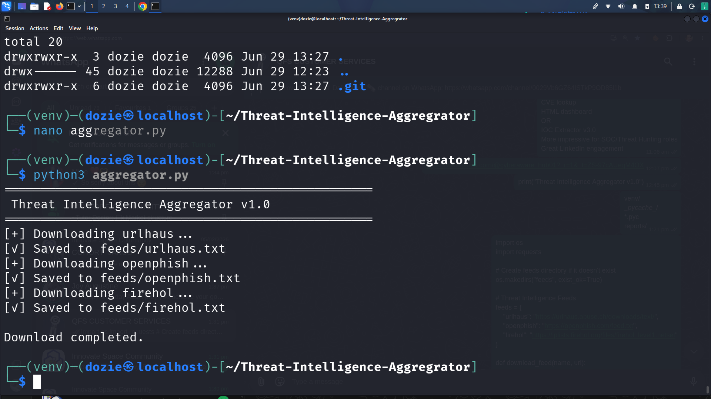
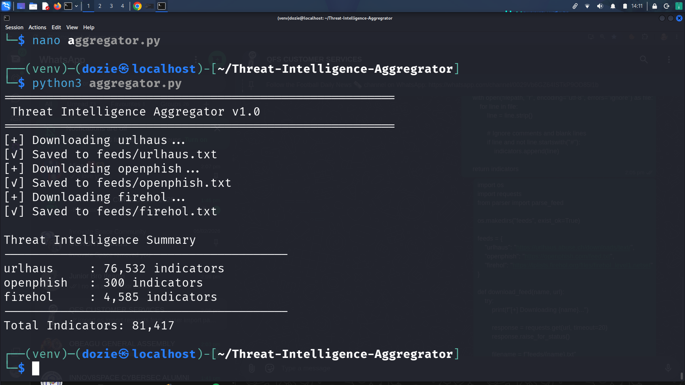
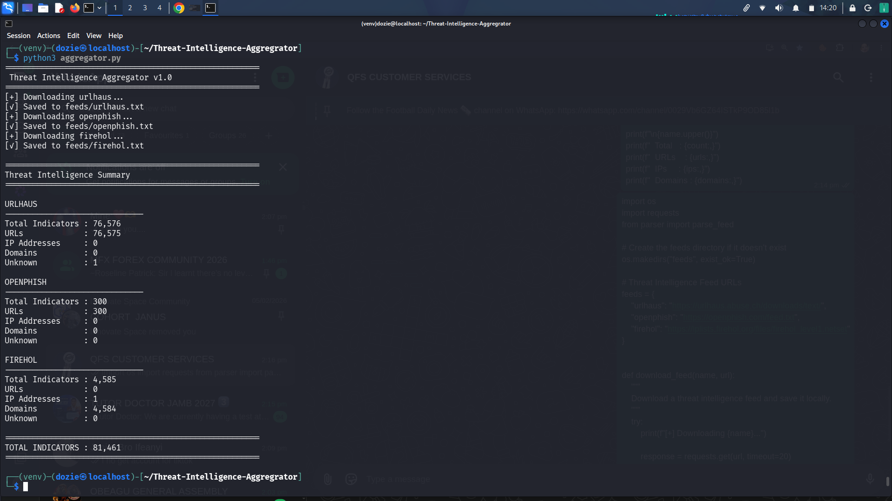
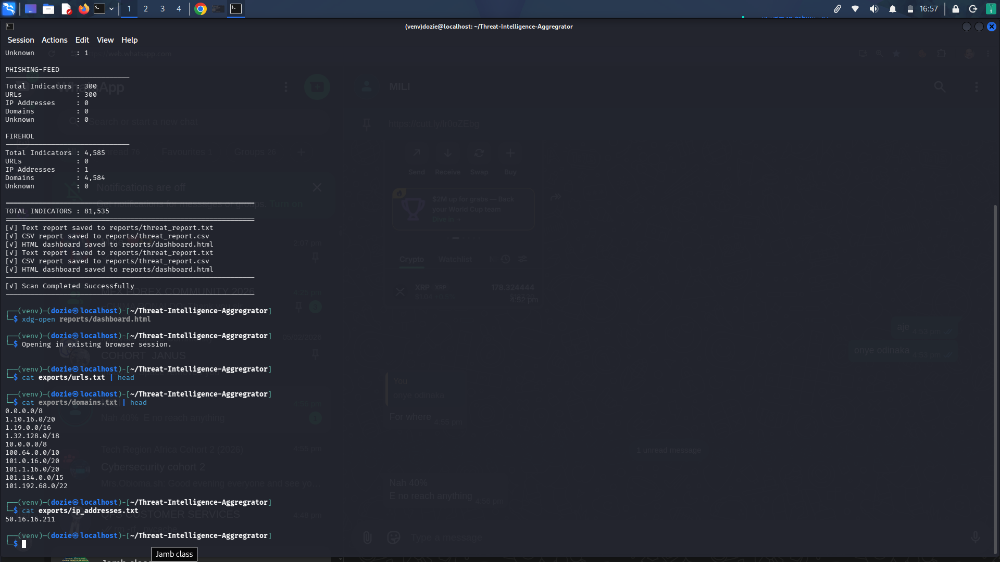
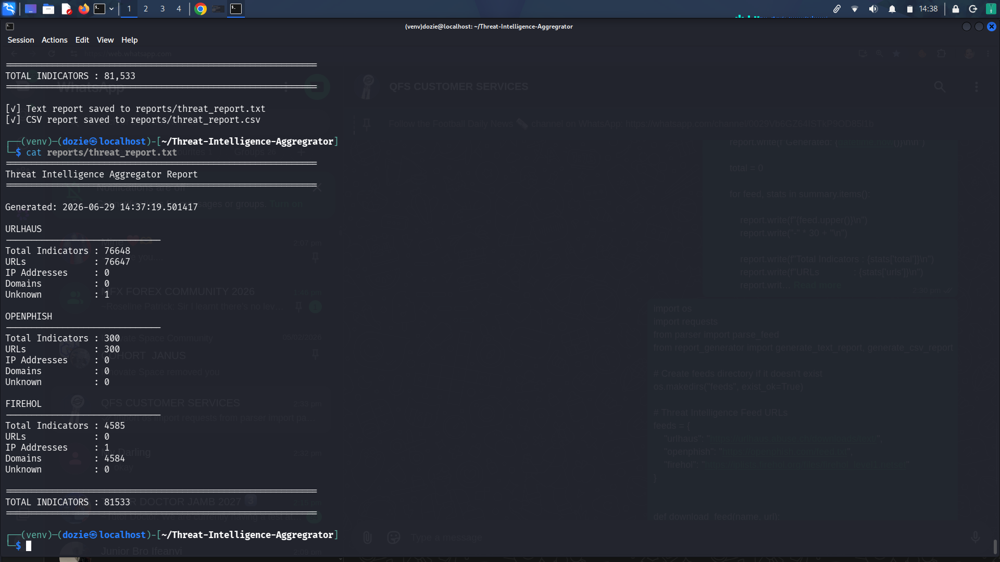
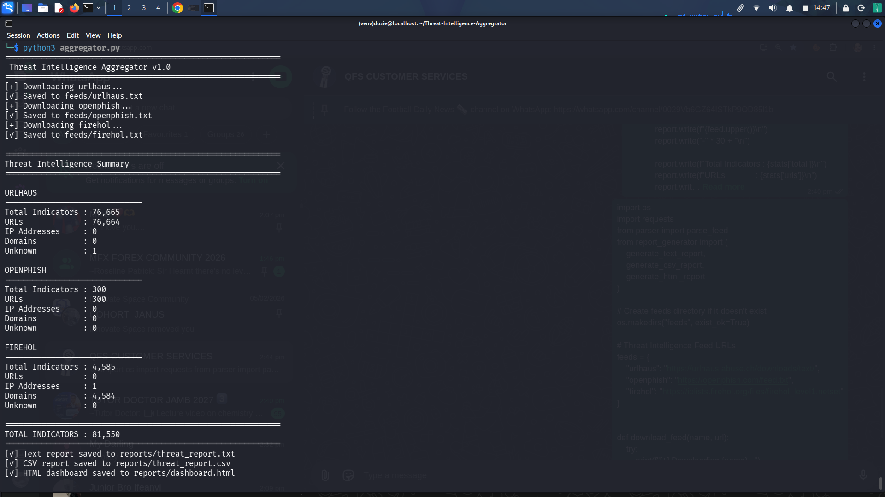
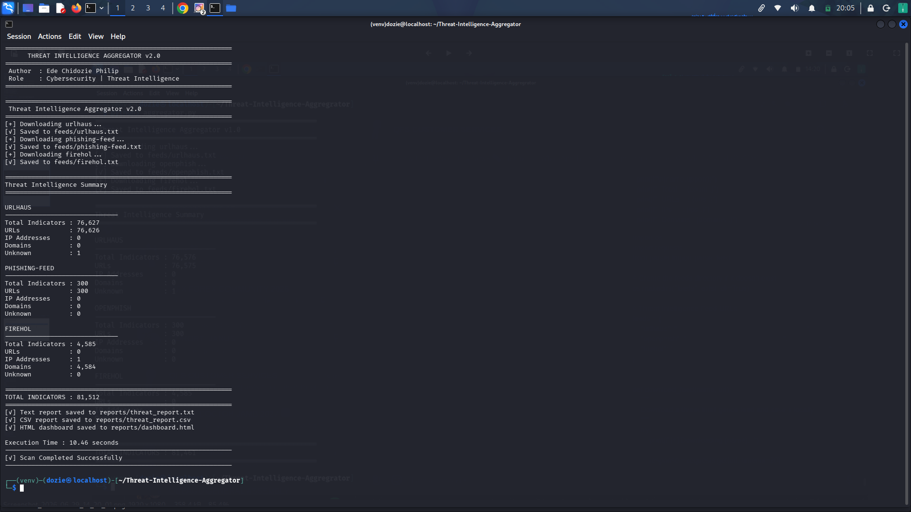
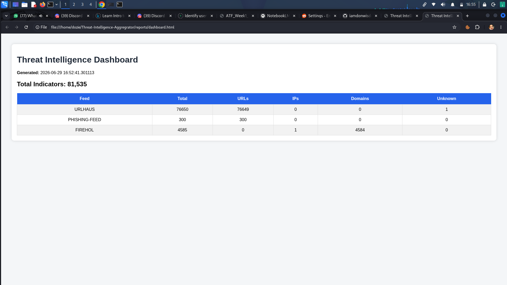

# Threat Intelligence Aggregator v2.0

## Overview

Threat Intelligence Aggregator is a Python-based cybersecurity tool that automatically downloads, parses, analyzes, and exports Indicators of Compromise (IOCs) from multiple open-source threat intelligence feeds.

The project demonstrates practical threat intelligence collection, IOC processing, reporting, and automation using Python.

---

## Features

- Download threat intelligence feeds automatically
- Parse URLs, Domains, and IP Addresses
- Generate TXT reports
- Generate CSV reports
- Generate HTML dashboard
- Export IOCs into separate files
- Logging support
- JSON configuration
- Command-line interface
- Error handling
- IOC statistics

---

## Supported Threat Feeds

- URLHaus
- OpenPhish
- FireHOL

---

## Project Structure

```
Threat-Intelligence-Aggregator/
│
├── aggregator.py
├── parser.py
├── exporter.py
├── logger.py
├── report_generator.py
├── cli.py
├── config.json
├── README.md
├── LICENSE
├── requirements.txt
│
├── feeds/
├── exports/
├── reports/
└── logs/
```

---

## Installation

```bash
git clone https://github.com/iamdonwisdom/Threat-Intelligence-Aggregator.git

cd Threat-Intelligence-Aggregator

python3 -m venv venv

source venv/bin/activate

pip install -r requirements.txt
```

---

## Usage

Run the application:

```bash
python3 aggregator.py
```

---

## Output

The application generates:

- HTML Dashboard
- CSV Report
- Text Report
- Exported IOC Files
- Application Logs

---

## Technologies Used

- Python 3
- Requests
- JSON
- HTML
- CSV

---
## Screenshots

## Screenshots

### Application Startup


### Feed Downloads


### Threat Intelligence Summary


### Exported IOCs


### HTML Dashboard


### Reports Generated


### Execution Time


### Project Structure


----
## Author

**Ede Chidozie Philip**

Cybersecurity | Threat Intelligence | SOC | Python Automation

---

## License

This project is licensed under the MIT License.

